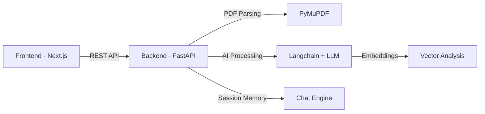

# 🎯 Career Compass

<div align="center">


[](https://nextjs.org/)
[](https://fastapi.tiangolo.com/)
[](https://www.python.org/)
[](https://www.typescriptlang.org/)
[](LICENSE)

**Transform your career journey with AI-powered resume analysis and personalized guidance**

[🚀 Live Demo](#) • [📖 Documentation](#documentation) • [🐛 Report Bug](https://github.com/yourusername/career-compass/issues) • [✨ Request Feature](https://github.com/yourusername/career-compass/issues)

</div>

---

## 📋 Table of Contents

- [✨ Features](#-features)
- [🎬 Demo](#-demo)
- [🏗️ Architecture](#️-architecture)
- [🚀 Quick Start](#-quick-start)
- [📦 Installation](#-installation)
- [🔧 Configuration](#-configuration)
- [📚 API Documentation](#-api-documentation)
- [🧪 Testing](#-testing)
- [🚢 Deployment](#-deployment)
- [🗺️ Roadmap](#️-roadmap)
- [🤝 Contributing](#-contributing)
- [📄 License](#-license)

---

## ✨ Features

### 🎯 **AI-Powered Resume Analysis**
- **Smart Matching**: Compare resumes against job descriptions with advanced NLP
- **Gap Identification**: Discover missing skills and competencies
- **Similarity Scoring**: Get quantitative match scores (0-100)
- **PDF Support**: Automatic text extraction from PDF resumes

### 💬 **Interactive Career Chat**
- **Conversational AI**: Real-time career guidance powered by Langchain
- **Context-Aware**: Maintains conversation history for personalized advice
- **Skill Recommendations**: Get actionable suggestions for career growth

### 🎨 **Modern UI/UX**
- **Dark/Light Theme**: Seamless theme switching with persistent preferences
- **Responsive Design**: Works flawlessly on desktop, tablet, and mobile
- **Real-time Updates**: Instant feedback with loading states and animations
- **Professional Interface**: Clean, business-class design with Tailwind CSS

---

## 🎬 Demo

### Resume Analysis Flow
```
Upload Resume (PDF) → Paste Job Description → AI Analysis → Get Results
```

### Key Metrics Provided
- ✅ **Overall Match Score**: 0-100 rating
- 🎯 **Matching Skills**: Skills you already have
- ⚠️ **Missing Skills**: Areas to improve
- 💪 **Strengths**: What makes your profile stand out
- 📈 **Improvement Suggestions**: Actionable next steps

---

## 🏗️ Architecture

### System Overview



### Technology Stack

#### **Frontend** 🎨
| Technology | Purpose | Version |
|------------|---------|---------|
| Next.js | React Framework | 16+ |
| TypeScript | Type Safety | 5.0+ |
| Tailwind CSS v4 | Styling | 4.1+ |
| Axios | API Client | Latest |
| Lucide React | Icons | Latest |

#### **Backend** ⚙️
| Technology | Purpose | Version |
|------------|---------|---------|
| FastAPI | Web Framework | 0.104+ |
| Python | Language | 3.12 |
| Langchain | LLM Integration | Latest |
| PyMuPDF | PDF Processing | Latest |
| Pydantic | Data Validation | 2.0+ |
| Uvicorn | ASGI Server | Latest |

#### **DevOps** 🚀
- Docker & Docker Compose
- GitHub Actions (CI/CD)
- Makefile (Task Automation)

---

## 🚀 Quick Start

### Prerequisites

- **Node.js** 18+ and npm/yarn
- **Python** 3.12+
- **Docker** (optional, for containerized setup)
- **Git**

### One-Command Setup

```bash
# Clone the repository
git clone https://github.com/yourusername/career-compass.git
cd career-compass

# Start with Docker (recommended)
make run

# Or start manually
make install
make dev
```

Access the application:
- **Frontend**: http://localhost:3000
- **Backend API**: http://localhost:8000
- **API Docs**: http://localhost:8000/docs

---

## 📦 Installation

### Option 1: Docker (Recommended)

```bash
# Start all services
docker-compose up --build

# Run in detached mode
docker-compose up -d

# View logs
docker-compose logs -f

# Stop services
docker-compose down
```

### Option 2: Manual Setup

#### Backend Setup

```bash
cd backend

# Create virtual environment
python -m venv venv
source venv/bin/activate  # On Windows: venv\Scripts\activate

# Install dependencies
pip install -r requirements.txt

# Run development server
uvicorn app.main:app --reload --port 8000
```

#### Frontend Setup

```bash
cd frontend

# Install dependencies
npm install

# Set up environment variables
cp .env.local.example .env.local
# Edit .env.local with your configuration

# Run development server
npm run dev
```

---

## 🔧 Configuration

### Environment Variables

#### **Frontend** (`frontend/.env.local`)

```env
# API Configuration
NEXT_PUBLIC_API_URL=http://localhost:8000/api/v1

# Optional: Analytics
NEXT_PUBLIC_GA_ID=your-ga-id
```

#### **Backend** (`backend/.env`)

```env
# LLM Configuration
OPENAI_API_KEY=your-openai-key
LLM_MODEL=gpt-4
LLM_TEMPERATURE=0.7

# Server Configuration
HOST=0.0.0.0
PORT=8000
RELOAD=True

# CORS Settings
ALLOWED_ORIGINS=http://localhost:3000,https://yourproduction.com
```

---

## 📚 API Documentation

### Base URL
```
http://localhost:8000/api/v1
```

### Endpoints

#### **1. Analyze Resume**

```http
POST /analyze
Content-Type: multipart/form-data

Parameters:
- resume: File (PDF)
- job_description: String

Response:
{
  "overallScore": 78,
  "matchingSkills": ["Python", "FastAPI", "React"],
  "missingSkills": ["Kubernetes", "AWS"],
  "strengths": ["Strong technical foundation..."],
  "improvements": ["Add cloud certifications..."],
  "feedback": "Your profile demonstrates..."
}
```

#### **2. Career Chat**

```http
POST /chat
Content-Type: application/json

Body:
{
  "message": "What skills should I focus on?",
  "session_id": "optional-session-id"
}

Response:
{
  "response": "Based on your profile...",
  "session_id": "generated-session-id"
}
```

### Interactive API Documentation

Visit http://localhost:8000/docs for Swagger UI with full API documentation and testing capabilities.

---

## 🧪 Testing

### Backend Tests

```bash
cd backend

# Run all tests
pytest

# Run with coverage
pytest --cov=app tests/

# Run specific test file
pytest tests/test_api.py -v
```

### Frontend Tests

```bash
cd frontend

# Run tests
npm test

# Run with coverage
npm test -- --coverage

# Run in watch mode
npm test -- --watch
```

---

## 🚢 Deployment

### Production Build

#### Frontend

```bash
cd frontend

# Build for production
npm run build

# Start production server
npm start
```

#### Backend

```bash
cd backend

# Install production dependencies
pip install -r requirements.txt

# Run with Gunicorn
gunicorn app.main:app -w 4 -k uvicorn.workers.UvicornWorker
```

### Docker Production

```bash
# Build production images
docker-compose -f docker-compose.prod.yml build

# Deploy
docker-compose -f docker-compose.prod.yml up -d
```

### Environment Setup

#### Recommended Platforms
- **Frontend**: Vercel, Netlify, AWS Amplify
- **Backend**: AWS EC2/ECS, Google Cloud Run, DigitalOcean
- **Database** (if needed): PostgreSQL on AWS RDS, Supabase

---

## 🗺️ Roadmap

### ✅ **Phase 1: Core Features** (Completed)
- [x] Resume upload and parsing
- [x] Job description analysis
- [x] AI-powered gap analysis
- [x] Interactive chat interface
- [x] Dark/Light theme

### 🚧 **Phase 2: Enhanced Features** (In Progress)
- [ ] Resume strength scorer with keyword analysis
- [ ] ATS (Applicant Tracking System) compatibility check
- [ ] Cover letter generator
- [ ] Interview preparation assistant
- [ ] Salary insights and negotiation tips

### 🔮 **Phase 3: Advanced Features** (Planned)
- [ ] Real-time job board integration
- [ ] LinkedIn profile analyzer
- [ ] Career path visualization
- [ ] Skill gap learning resources
- [ ] Multi-language support
- [ ] Admin analytics dashboard
- [ ] User authentication and profiles
- [ ] Resume version history

### 💡 **Phase 4: Enterprise Features** (Future)
- [ ] Team collaboration features
- [ ] Bulk resume processing
- [ ] Custom AI model training
- [ ] White-label solution
- [ ] API rate limiting and tiers

---

## 🤝 Contributing

We welcome contributions! Please follow these steps:

### 1. Fork the Repository

```bash
git clone https://github.com/yourusername/career-compass.git
cd career-compass
```

### 2. Create a Feature Branch

```bash
git checkout -b feature/amazing-feature
```

### 3. Make Your Changes

- Follow the existing code style
- Write tests for new features
- Update documentation as needed

### 4. Commit Your Changes

```bash
git commit -m "feat: add amazing feature"
```

We follow [Conventional Commits](https://www.conventionalcommits.org/):
- `feat:` New feature
- `fix:` Bug fix
- `docs:` Documentation changes
- `style:` Code style changes
- `refactor:` Code refactoring
- `test:` Adding tests
- `chore:` Maintenance tasks

### 5. Push and Create Pull Request

```bash
git push origin feature/amazing-feature
```

Then open a Pull Request on GitHub.

### Code Quality Standards

- **Backend**: Follow PEP 8, use Black for formatting, Ruff for linting
- **Frontend**: Use ESLint and Prettier, follow TypeScript best practices
- **Tests**: Maintain >80% code coverage
- **Documentation**: Update README and inline comments

---

## 📄 License

This project is licensed under the MIT License - see the [LICENSE](LICENSE) file for details.

---

## 👥 Team

**Mr. Wesly** - *Engineering, Architecture & Deployment Lead*

---

## 🙏 Acknowledgments

- [FastAPI](https://fastapi.tiangolo.com/) - Modern Python web framework
- [Next.js](https://nextjs.org/) - React framework for production
- [Langchain](https://www.langchain.com/) - LLM application framework
- [Tailwind CSS](https://tailwindcss.com/) - Utility-first CSS framework
- [Lucide](https://lucide.dev/) - Beautiful icon library

---

## 📞 Support

- 📧 Email: support@careercompass.dev
- 💬 Discord: [Join our community](https://discord.gg/careercompass)
- 🐦 Twitter: [@CareerCompassAI](https://twitter.com/CareerCompassAI)
- 📖 Documentation: [docs.careercompass.dev](https://docs.careercompass.dev)

---

## ⭐ Star History

If you find this project useful, please consider giving it a star! ⭐

[](https://star-history.com/#yourusername/career-compass&Date)

---

<div align="center">

**Built with ❤️ by developers, for developers**

[⬆ Back to Top](#-career-compass)

</div>
